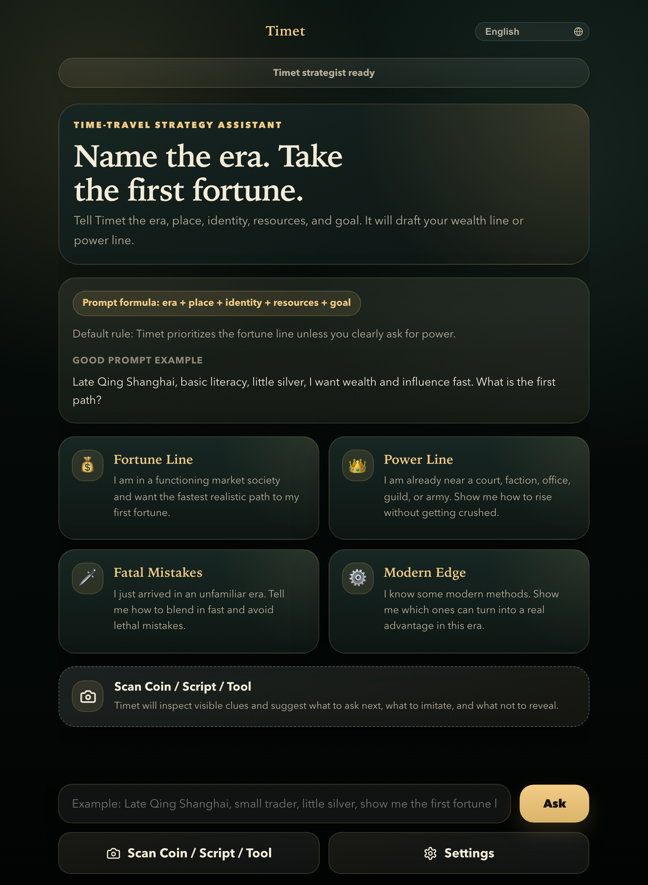
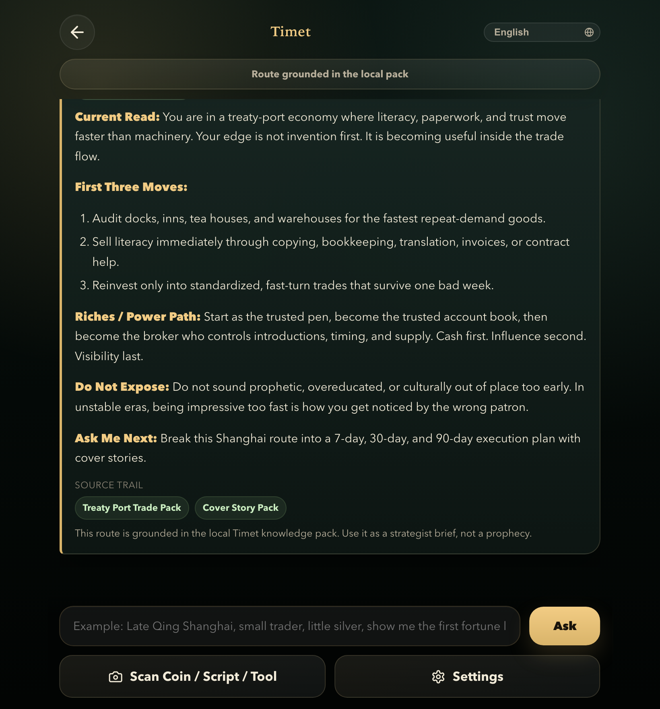

# Timet / 穿越助手

<p align="center">
  <a href="https://github.com/wimi321/timet/releases">
    
  </a>
  <a href="https://github.com/wimi321/timet/actions/workflows/ci.yml">
    
  </a>
  <a href="./LICENSE">
    
  </a>
  
  <a href="https://github.com/wimi321/timet/stargazers">
    
  </a>
</p>

<p align="center">
  
  
  
  
  
  
</p>

<p align="center">
  <strong>An app for time travelers.</strong><br/>
  <sub>After you time-travel, there is no Wi-Fi, no cloud, no API key.<br/>The only AI that still works is the one already on your phone.</sub>
</p>

<p align="center">
  <a href="https://github.com/wimi321/timet/releases/latest/download/timet-v0.2.0-arm64.apk">
    
  </a>
</p>

<p align="center">
  <a href="./README.md">English</a>
  ·
  <a href="./README.zh-CN.md">简体中文</a>
  ·
  <a href="https://github.com/wimi321/timet/releases">Releases</a>
  ·
  <a href="./docs/ROUTES.md">Route Design</a>
  ·
  <a href="./docs/KNOWLEDGE_PACK.md">Knowledge Pack</a>
  ·
  <a href="https://github.com/wimi321/timet/discussions">Discussions</a>
</p>

<p align="center">
  
</p>

Tell Timet the **era**, **place**, **identity**, **starting resources**, and **goal** — it drafts a playable strategy route for wealth, influence, cover, or modern-edge leverage. No lore dumps, no hand-waving. Every answer lands in a **structured five-part brief** you can act on immediately.

> **Why on-device AI?** Timet runs [Gemma 4](https://ai.google.dev/gemma) entirely on your phone via [LiteRT](https://ai.google.dev/edge/litert) — no server, no internet, no API calls. The model ships with the app (or downloads once), then works offline forever. If you actually time-traveled to Song Dynasty Kaifeng or Tudor London, your cloud-based ChatGPT is gone. Timet still runs. That's the point.

## Product Preview

<table>
  <tr>
    <td width="50%">
      
    </td>
    <td width="50%">
      
    </td>
  </tr>
  <tr>
    <td valign="top">
      <strong>Home briefing</strong><br/>
      Start with <code>era + place + identity + resources + goal</code>, then pick a route or type straight into the strategist.
    </td>
    <td valign="top">
      <strong>Route answer</strong><br/>
      Timet replies in a five-part strategist brief, grounded in the local knowledge pack and written for action.
    </td>
  </tr>
</table>

## Features

- **Gemma 4 on your phone** — Runs Google's Gemma 4 (2B / 4B) locally via LiteRT. No internet required after setup. Your strategist survives the time-travel with you.
- **100% offline architecture** — Bundled knowledge packs + on-device model. No cloud, no API key, no subscription. Works in airplane mode, works in the Song Dynasty.
- **Route-first, not lore-first** — Timet gives you a playable path, not a wall of background trivia.
- **Structured answers** — Every reply converges on five sections: situation read, first moves, main path, fatal mistakes, and next question.
- **8 languages** — Chinese, English, Japanese, Korean, Spanish, French, and German deep-adapted.
- **Cross-platform** — One codebase ships to Web, Android, and iOS via Capacitor.

<details>
<summary><strong>What's New in v0.2.0</strong></summary>

- Auto-resizing textarea for multi-line prompts (Enter to send, Shift+Enter for newline)
- CSS animations: staggered card entrance, message slide-in, modal slide-up
- Visual model download progress bar
- Copy and share buttons on every AI response
- Confirmation dialog before clearing conversations
- Haptic feedback on native devices
- Model panel focus trap and ARIA accessibility
- Complete translations for Japanese, Korean, Spanish, French, and German
- App.tsx refactored from 1308 to ~550 lines (6 extracted components)

</details>

## Architecture

<p align="center">
  
</p>

Timet runs a **dual-stack** architecture: a React 18 frontend communicates with a Dart backend through the `BeaconBridge` abstraction. On mobile, the Capacitor bridge routes requests to on-device Gemma 4 inference via LiteRT, with offline knowledge retrieval via RAG. On the web, a strict bridge enforces that no server dependency exists. Everything runs locally — no cloud, no API keys.

## How It Works

**Input formula:**

`era + place + identity + resources + goal`

**Example prompts:**

| Route | Prompt |
| --- | --- |
| Fortune Line | `我在北宋汴京，识字，有一点碎银，怎么三个月赚到第一桶金？` |
| Fortune Line | `Regency London, literate clerk, a few guineas, how do I build my first fortune in 90 days?` |
| Power Line | `Tudor London, I serve in a noble household. How do I gain influence without getting crushed?` |
| Fatal Mistakes | `I just arrived in medieval London with no patron. What must I hide first to blend in?` |

**Answer shape — every response follows this contract:**

1. **Current Read** — assess the board before you move
2. **First Three Moves** — low-barrier, repeatable first steps
3. **Riches / Power Path** — the main climb
4. **Do Not Expose** — what will get you killed or exiled
5. **Ask Me Next** — break the route into 7 / 30 / 90-day phases

<details>
<summary>Full answer example</summary>

```text
Current Read
You are in a high-circulation city with low starting capital,
which means trust and turnover matter more than miracle inventions.

First Three Moves
1. Start with repeat-demand goods or services.
2. Win trust with clean ledgers and fixed prices.
3. Anchor near inns, docks, guild traffic, or literate commerce.

Riches / Power Path
Stabilize cash flow first, then use paperwork, brokerage,
supply discipline, or patronage to climb.

Do Not Expose
Do not sound supernatural, over-informed, or culturally wrong too early.

Ask Me Next
Break this route into 7-day, 30-day, and 90-day phases.
```

</details>

## Core Routes

| Route | What it does | Best used for |
| --- | --- | --- |
| `Fortune Line` | Finds the fastest realistic path to your first durable cash flow. | Trade, brokerage, ledgers, small goods, repeat demand |
| `Power Line` | Maps how to become useful before becoming visible. | Patronage, office, clerical leverage, court or military adjacency |
| `Fatal Mistakes` | Tells you what not to reveal before you understand the local rules. | Arrival cover, etiquette, speech, customs, identity protection |
| `Modern Edge` | Downgrades modern knowledge into era-appropriate advantages. | Process, packaging, standardization, practical workshop upgrades |
| `Visual Clues` | Uses visible objects as context and tells you what to ask next. | Coins, seals, script, garments, printed matter, artifacts |

## Getting Started

**Prerequisites:** Node.js >= 20 · Dart >= 3.4

```bash
# Install and build knowledge pack
npm install
npm run knowledge:build

# Start dev server
npm run dev

# Run tests
npm test && dart test

# Production build
npm run build
```

**Mobile (requires Xcode / Android Studio):**

```bash
npm run mobile:ios
npm run mobile:android
```

## Tech Stack

React 18 · TypeScript · Vite 8 · Vitest · Capacitor 8 · Dart 3 · Gemma 4 (LiteRT) · Offline Knowledge RAG

## Roadmap

- [x] Route-driven V1: wealth, power, cover, and modern-edge planning
- [x] Chinese and English deep-adapted product copy
- [x] Curated offline knowledge pack with route-aware retrieval
- [x] Public GitHub release with CI, discussions, and release metadata
- [x] Polished public demo assets and storefront-style screenshots
- [x] Component architecture refactor + UX animation polish
- [x] Full translations for 8 languages (en, zh-CN, zh-TW, ja, ko, es, fr, de)
- [x] Accessibility: focus trap, ARIA roles, screen reader support
- [ ] GitHub Pages live demo
- [ ] Multi-turn session memory for follow-up questions
- [ ] Community-contributed knowledge packs
- [ ] Custom route definitions
- [ ] Broader historical region and era coverage

## Contributing

Timet welcomes contributions — whether it is a new knowledge pack, a language improvement, or a bug fix. See [CONTRIBUTING.md](./CONTRIBUTING.md) for guidelines.

## Repository Guide

- [Route Design](./docs/ROUTES.md)
- [Knowledge Pack Notes](./docs/KNOWLEDGE_PACK.md)
- [Security Policy](./SECURITY.md)
- [Changelog](./CHANGELOG.md)

## License

Timet is released under the [Apache-2.0 License](./LICENSE).

---

<p align="center">
  Timet runs Gemma 4 on your phone. No cloud. No API key. Just you and your strategist.<br/>
  If that sounds useful for your next time-travel, give it a <a href="https://github.com/wimi321/timet/stargazers">star</a>.
</p>
