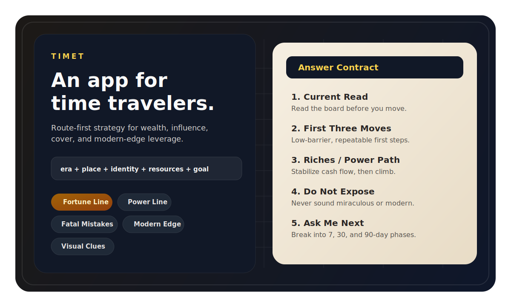
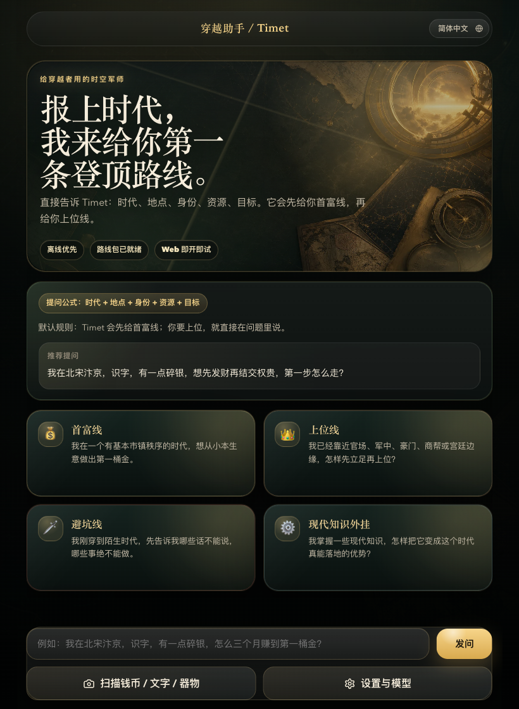
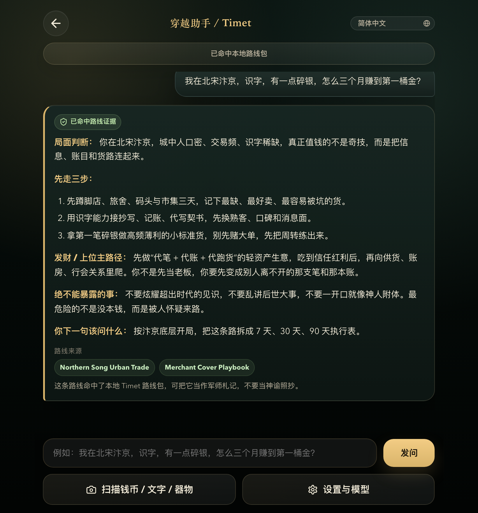
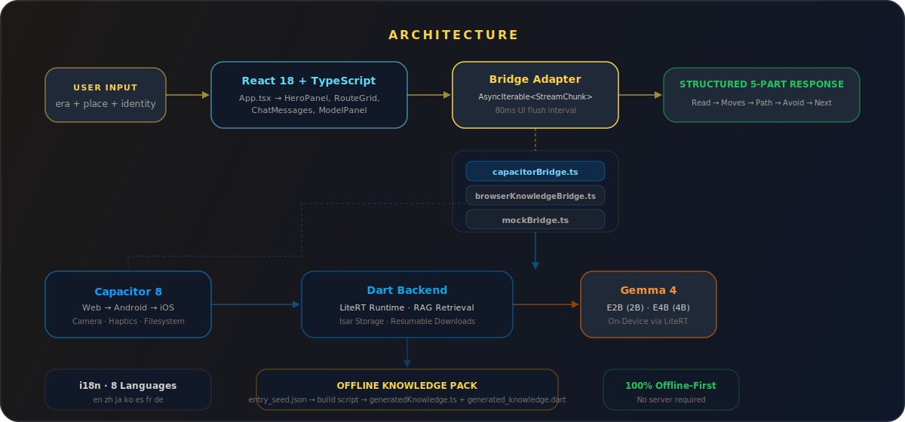

# 穿越助手 / Timet

<p align="center">
  <a href="https://github.com/wimi321/timet/releases">
    
  </a>
  <a href="https://github.com/wimi321/timet/actions/workflows/ci.yml">
    
  </a>
  <a href="./LICENSE">
    
  </a>
  
  <a href="https://github.com/wimi321/timet/stargazers">
    
  </a>
</p>

<p align="center">
  
  
  
  
  
  
</p>

<p align="center">
  <strong>给穿越者准备的极简军师 App。</strong><br/>
  <sub>穿越之后没有 Wi-Fi，没有云，没有 API Key。<br/>唯一能用的 AI，是已经装在你手机里的那个。</sub>
</p>

<p align="center">
  <a href="https://github.com/wimi321/timet/releases/latest/download/timet-v0.2.1-arm64.apk">
    
  </a>
</p>

<p align="center">
  <a href="./README.md">English</a>
  ·
  <a href="./README.zh-CN.md">简体中文</a>
  ·
  <a href="https://github.com/wimi321/timet/releases">发布版本</a>
  ·
  <a href="./docs/ROUTES.md">路线设计</a>
  ·
  <a href="./docs/KNOWLEDGE_PACK.md">知识包</a>
  ·
  <a href="https://github.com/wimi321/timet/discussions">讨论区</a>
</p>

<p align="center">
  
</p>

告诉 Timet 你的**时代**、**地点**、**身份**、**手里资源**和**目标**——它会给你一条能走的首富线、上位线、避坑线或现代知识外挂路线。不堆设定，不空谈背景。每条回答都收敛成**五段式军师简报**，拿到就能拆步骤执行。

> **为什么必须端侧大模型？** Timet 通过 [LiteRT](https://ai.google.dev/edge/litert) 在手机上运行 Google [Gemma 4](https://ai.google.dev/gemma) 大模型——不需要服务器，不需要联网，不需要 API 调用。模型随 App 安装（或首次下载一次），之后永久离线可用。真穿越到北宋汴京或都铎伦敦的时候，你的 ChatGPT 没信号了，Timet 还能用。这才是重点。

## 产品预览

<table>
  <tr>
    <td width="50%" valign="top">
      
      <br/><br/>
      <strong>首页封面态</strong><br/>
      直接按 <code>时代 + 地点 + 身份 + 资源 + 目标</code> 开问，也可以从路线入口切入。
    </td>
    <td width="50%" valign="top">
      
      <br/><br/>
      <strong>军师回答态</strong><br/>
      Timet 固定收敛成五段式路线答复，给出命中的知识包来源，方便继续拆阶段执行。
    </td>
  </tr>
</table>

## 特性

- **手机上跑 Gemma 4 大模型** — 通过 LiteRT 在手机端本地运行 Google Gemma 4（2B / 4B）。安装后不再需要联网。你的军师跟你一起穿越。
- **100% 离线架构** — 内置知识包 + 端侧模型推理。无云服务、无 API Key、无订阅费。飞行模式能用，北宋也能用。
- **Web 端即开即试** — 浏览器版本会直接调用本地路线知识包回答，用户不用先装 App 也能体验 Timet 的核心问答。
- **先给路线，不先堆设定** — 重点是怎么走，不是背景故事复述。
- **五段式结构化回答** — 每条回复都收敛为：局面判断、先走三步、主路径、避坑项、下一步该问什么。
- **8 种语言** — 英文、简体中文、繁体中文、日语、韩语、西班牙语、法语、德语深度适配，所有界面文本均有完整翻译。
- **全平台** — 一套代码通过 Capacitor 发布到 Web、Android 和 iOS。

<details>
<summary><strong>v0.2.1 新特性</strong></summary>

- Web 预览版现在可直接用本地浏览器知识桥接回答问题
- README 和架构说明已准确区分 Web 预览与移动端 Gemma 4 推理
- Release 元数据、Android/iOS 版本号与 APK 下载徽章已统一到 v0.2.1

### 同时包含 v0.2.0 的打磨

- 聊天输入升级为自动调高的多行 textarea（Enter 发送，Shift+Enter 换行）
- CSS 动画：路由卡片交错入场、消息滑入、模型面板底部滑入
- 模型下载可视化进度条
- AI 回复支持一键复制和分享
- 清除对话前弹出确认弹窗，防止误操作
- 原生设备按钮触觉反馈
- 模型面板焦点陷阱和 ARIA 无障碍支持
- 新增日语、韩语、西班牙语、法语、德语完整翻译
- App.tsx 从 1308 行重构为 ~550 行（提取 6 个独立组件）

</details>

## 架构

<p align="center">
  
</p>

Timet 采用**双栈架构**：React 18 前端通过桥接抽象层发起请求。移动端通过 Capacitor 桥接，将请求路由到端侧 Gemma 4 推理引擎（LiteRT），并通过 RAG 检索离线知识包。Web 端使用浏览器知识桥接，直接调用同一套离线路线包做即时预览。一切在本地运行——无需云服务、无需 API Key。

## 工作原理

**提问公式：**

`时代 + 地点 + 身份 + 资源 + 目标`

**提问示例：**

| 路线 | 提问 |
| --- | --- |
| 首富线 | `我在北宋汴京，识字，有一点碎银，怎么三个月赚到第一桶金？` |
| 上位线 | `我在晚清上海通商口岸，给商号跑单，怎样先结交靠山再上位？` |
| 避坑线 | `我在南宋临安，刚到陌生城里，没有靠山，最先不能暴露什么？` |
| 现代知识外挂 | `我在晚清上海，有一点本钱，哪些现代知识最先能变成真钱？` |

**回答契约 — 每条回复固定收敛为五段：**

1. **局面判断** — 先看清盘面再出手
2. **先走三步** — 低门槛、可复制的起手式
3. **发财 / 上位主路径** — 核心攀升路线
4. **绝不能暴露的事** — 会让你暴露或送命的禁区
5. **你下一句该问什么** — 把路线拆成 7 / 30 / 90 天

<details>
<summary>完整回答示例</summary>

```text
局面判断
你处在一个高流通、低本钱的起步局面，
真正值钱的是周转、信用和掩护，而不是一开局就跨时代发明。

先走三步
1. 先做高频、轻资产、重复需求的货或服务。
2. 先把账本、标价和交付稳定下来。
3. 先靠近客栈、码头、书坊、行会一类稳定客流。

发财 / 上位主路径
先让现金流站稳，再把文书、渠道、票据、关系网一层层接上去。

绝不能暴露的事
不要让人觉得你像妖人、骗子，或对这个时代知道得不正常。

你下一句该问什么
把这条路线拆成 7 天 / 30 天 / 90 天。
```

</details>

## 核心路线

| 路线 | 作用 | 适合的问题 |
| --- | --- | --- |
| `首富线` | 找到第一条稳定赚钱的现实路径。 | 小本生意、商路、账房、套利、渠道 |
| `上位线` | 先变成有用的人，再慢慢变成不能绕过的人。 | 门路、结盟、官场边缘、军政后勤、豪门依附 |
| `避坑线` | 先告诉你哪些话不能说、哪些事不能做。 | 刚穿越、身份未稳、礼法未知、口音和习俗风险 |
| `现代知识外挂` | 把现代知识降级成这个时代能真的吃下去的优势。 | 工艺、流程、包装、标准化、组织效率 |
| `视觉线索` | 从钱币、文字、器物这些线索里反推下一步。 | 看图提问、环境判断、补时代感知 |

## 快速开始

**前置条件：** Node.js >= 20 · Dart >= 3.4

```bash
# 安装依赖并构建知识包
npm install
npm run knowledge:build

# 启动开发服务器
npm run dev

# 运行测试
npm test && dart test

# 生产构建
npm run build
```

**移动端（需要 Xcode / Android Studio）：**

```bash
npm run mobile:ios
npm run mobile:android
```

## 技术栈

React 18 · TypeScript · Vite 8 · Vitest · Capacitor 8 · Dart 3 · Gemma 4 (LiteRT) · 离线知识 RAG

## 路线图

- [x] 完成路线驱动的 V1 问答形态
- [x] 补齐中文与英文深度适配产品文案
- [x] 完成首批离线穿越知识包与路线感知检索
- [x] 完成公开 GitHub 仓库、CI 与 Release
- [x] 补齐公开展示素材和 README 截图
- [x] 组件化架构重构 + UX 动画打磨
- [x] 8 种语言完整翻译（en, zh-CN, zh-TW, ja, ko, es, fr, de）
- [x] 无障碍改进：焦点陷阱、ARIA 角色、屏幕阅读器支持
- [ ] GitHub Pages 在线演示
- [ ] 多轮追问的 Session Memory
- [ ] 社区贡献知识包流程
- [ ] 自定义路线支持
- [ ] 扩大时代与地区知识覆盖面

## 参与贡献

欢迎贡献——无论是新知识包、语言改进还是 bug 修复。请先阅读 [CONTRIBUTING.zh-CN.md](./CONTRIBUTING.zh-CN.md)。

## 仓库导览

- [路线设计说明](./docs/ROUTES.md)
- [知识包说明](./docs/KNOWLEDGE_PACK.md)
- [安全策略](./SECURITY.zh-CN.md)
- [变更日志](./CHANGELOG.md)

## License

Timet 基于 [Apache-2.0](./LICENSE) 开源。

---

<p align="center">
  Timet 在你手机上运行 Gemma 4 大模型。无需云服务，无需 API Key，只有你和你的军师。<br/>
  如果下次穿越你也想带上它，欢迎给一颗 <a href="https://github.com/wimi321/timet/stargazers">Star</a>。
</p>
